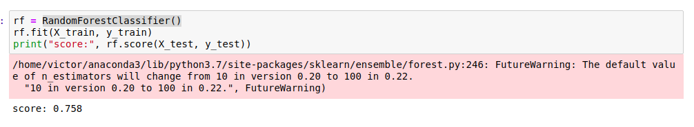
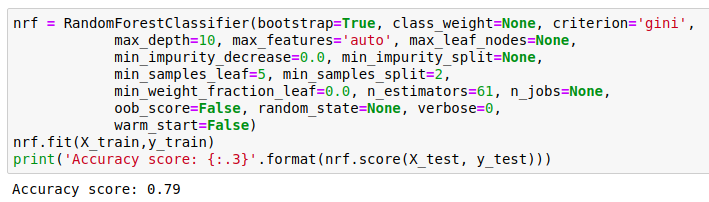
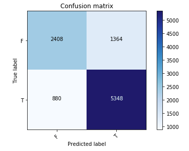
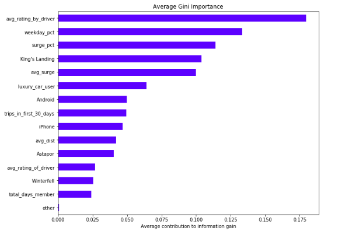
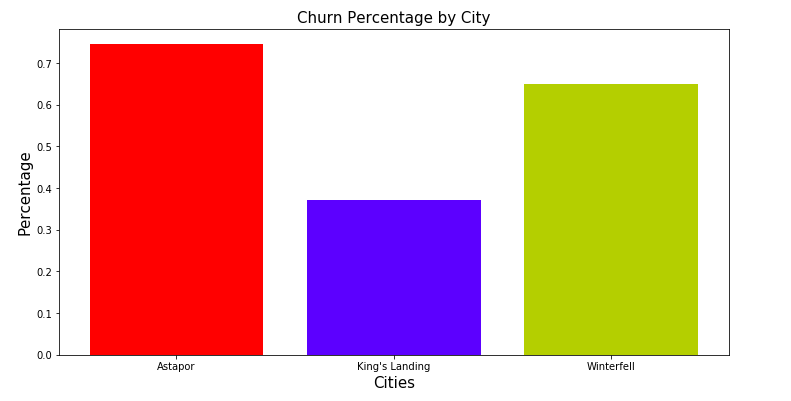
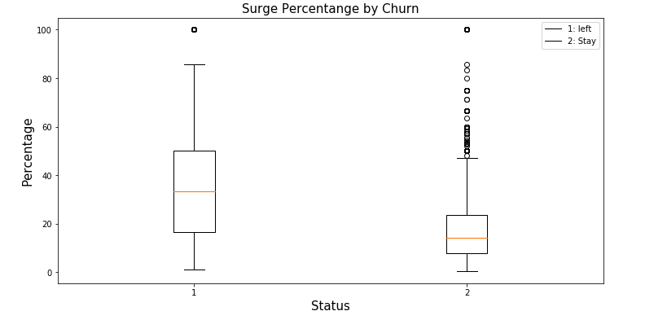

# A (4 hours) look into a Churn Prediction Case
A ride-sharing company (Company X) is interested in predicting rider retention. To help explore this question, we have provided a sample dataset of a cohort of users who signed up for an account in January 2014. The data was pulled on July 1, 2014; we consider a user retained if they were “active” (i.e. took a trip) in the preceding 30 days (from the day the data was pulled). In other words, a user is "active" if they have taken a trip since June 1, 2014. The data, churn.csv, is NOT in the data folder. The data are split into train and test sets. You are encouraged to tune and estimate your model's performance on the train set, then see how it does on the unseen data in the test set at the end.

We would like you to use this data set to help understand what factors are the best predictors for retention, and offer suggestions to help Company X. Therefore, your task is not only to build a model that minimizes error, but also a model that allows you to interpret the factors that contributed to your predictions.

Here is a detailed description of the data:

city: city this user signed up in phone: primary device for this user
signup_date: date of account registration; in the form YYYYMMDD
last_trip_date: the last time this user completed a trip; in the form YYYYMMDD
avg_dist: the average distance (in miles) per trip taken in the first 30 days after signup
avg_rating_by_driver: the rider’s average rating over all of their trips
avg_rating_of_driver: the rider’s average rating of their drivers over all of their trips
surge_pct: the percent of trips taken with surge multiplier > 1
avg_surge: The average surge multiplier over all of this user’s trips
trips_in_first_30_days: the number of trips this user took in the first 30 days after signing up
luxury_car_user: TRUE if the user took a luxury car in their first 30 days; FALSE otherwise
weekday_pct: the percent of the user’s trips occurring during a weekday

## Workflow
### Data Cleaning

- For the phone column I created a new variable 'other' to include in our analysis

- For the avg_rating_of_driver, and the avg_rating_by_driver columns I took the average rating for each column, and used that average to replace the null values. 

- I created a new column 'total_days_member' to account for how many days someone has used the car service. After doing this I dropped the 'signup_date', and 'last_trip_date'

- I then created dummy columns for our city and phone variables, and then dropped 'phone' and 'city' from our data frame

### Model Building
- I determined that a Gradient Boosted model or random forest model are the best methods for analyzing churn rate. Because of our time limitations I went ahead with a random forest model.

- I performed a grid search for perameters on our random forest model. The best model had 61 trees, a max depth of 10, a min samples per leaf of 10. I got an accuracy score of .79. 

- I then decided to remove the phone variables to see if it improved our model. This was done because their importance was low compared to the other features in our model. When I did this our accuracy went down, so I went back to the previous model.

- I then ran our model with the test data and recieved an accuracy score of .776

Our model had a precision of 0.80, and a recall of 0.86

# Questions to address

## How did you compute the target?

I created a churn column based on when the last time an individual used the service. For this experiment, if the user had not used the service in the last 30 days they were considered to have churned. The data was collected on July 1, 2014. 

## What model did you use in the end? Why?

I used a random forest model for our analysis. Random forest was the best model for this experiment because I was dealing with a classification problem, and it is easy to tune. I was unable to differentiate the data with a straight line, so I knew logistic regression would not work.

## Alternative models you considered? Why are they not good enough?

I considered using gradient decient boosting, but I was worried about time. The random forest model can be run in parallel, so it is much faster.

## What performance metric did you use to evaluate the model? Why?

I used accuracy, precision, and recall to evaluate our model. I used these because they are the best metrics available to evaluate a Random Forest model. I originally used accuracy because my outcome classes were relatively balanced.

## Based on insights from the model, what plans do you propose to reduce churn?

I began looking into how I would reduce churn by looking into the features based on their importance.

I propose that the company allocates more resources to Winterfell and Astapor because they have a higher churn percentage compared to King's Landing. 

I also recommend assessing or reevaluating how surge pricing is implemented. I see a significant increase in churn when users experience rides while the price is surging. I wanted to run a hypothesis test to confirm the significant difference, but ran out of time.

## What are the potential impacts of implementing these plans or decisions? What performance metrics did you use to evaluate these decisions, why?

Ideally by allocating more resources to Winterfell and Astapor I will be able to decrease the churn rate in those cities.

By reassessing the implementation of surge pricing, I hope that the number of rides with surging prices will decrease, and less riders will churn. 

